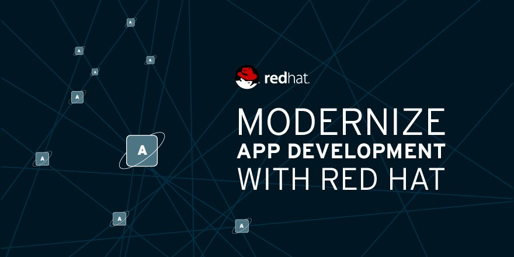

# Application Modernization Series

## Table of Contents
- [Introduction to Container](container.md)
  - What & Why Container?
  - Docker?
  - Demo: Build App & DB with Docker

- [Introduction to Container Orchestration Platform](openshift.md)
  - What & Why Container Orchestration Platform?
  - Basic concept of Application Deployment on Container Orchestration Platform 
  - Demo: Openshift Basic Developer Operation

- [DevOps and CI/CD](devops.md)
  - Presentation ([devops.pptx](presentation/devops.pptx))
  - Demo: [Build and Deploy with CI/CD Tool](https://github.com/rhthsa/openshift-demo/blob/main/ci-cd-with-jenkins.md)

- [Application Modernization](appmodern.md)
  - Develop New Applications The Modern Way
  - Demo: New Framework for Container
  - Migrate Old Applications New Again
  - Demo: Application Migration Tool

