# Application Modernization
<!-- TOC -->

- [Application Modernization](#application-modernization)
  - [Presentation](#presentation)
  - [Develop New Applications The Modern Way with Quarkus](#develop-new-applications-the-modern-way-with-quarkus)
  - [Live Coding](#live-coding)
  - [Quarkus JVM and Native](#quarkus-jvm-and-native)
  - [Build Docker Container with Quarkus Container Docker Plugin & Dev UI](#build-docker-container-with-quarkus-container-docker-plugin--dev-ui)
  - [Migrate Old Applications New Again with RH AMT](#migrate-old-applications-new-again-with-rh-amt)

<!-- /TOC -->

## Presentation

Presentation ([appmodern.pptx](presentation/appmodern.pptx))

## Develop New Applications The Modern Way with Quarkus

- Get source code from https://github.com/quarkusio/quarkus-quickstarts.git
- Use solution in folder getting-started-reactive
- comment code in ReactiveGreetingResource.java, some change in this demo don't support SSE
```java
//import org.jboss.resteasy.reactive.RestSseElementType;

// @GET
// @Produces(MediaType.SERVER_SENT_EVENTS)
// @RestSseElementType(MediaType.TEXT_PLAIN)
// @Path("/stream/{count}/{name}")
// public Multi<String> greetingsAsStream(int count, String name) {
//     return service.greetings(count, name);
// }
```
- Review REST Web Service in ReactiveGreetingResource.java, ReactiveGreetingService.java
- Review Dependency in pom.xml
```xml
<dependency>
  <groupId>io.quarkus</groupId>
  <artifactId>quarkus-resteasy-reactive</artifactId>
</dependency>
```
- run first quarkus in dev mode
```bash
$ mvn quarkus:dev
```
- open browser to http://localhost:8080 to view output
- open browser to http://localhost:8080/hello to test 1st REST API
- open browser to http://localhost:8080/q/dev/ to show quarkus dev ui

## Live Coding

- Test Change hello method in ReactiveGreetingResource.java in src/org/acme/getting/started folder to another such as
```java
@GET
@Produces(MediaType.TEXT_PLAIN)
public String hello() {
  return "sawasdee";
}
```
- None Restart maven, test call rest api again with curl or browser to http://localhost:8080/hello, see output in terminal
```bash
$ curl http://localhost:8080/hello
sawasdee%
```
- From previous demo, go to ReactiveGreetingResource.java in src/org/acme/getting/started folder, and add Logger 
```java
private static final Logger LOG = Logger.getLogger(ReactiveGreetingResource.class);
```
- import Logger package
```java
import org.jboss.logging.Logger;
```
- add log to hello method for print info of thread
```java
@GET
@Produces(MediaType.TEXT_PLAIN)
public String hello() {
  LOG.info("Hello!");
  return "hello";
}
```
- None Restart maven, test call rest api again with curl or browser to http://localhost:8080/hello, see output in terminal, quarkus will show vert.x-eventloop-thread-xx --> that is reactive!
```bash
__  ____  __  _____   ___  __ ____  ______
 --/ __ \/ / / / _ | / _ \/ //_/ / / / __/
 -/ /_/ / /_/ / __ |/ , _/ ,< / /_/ /\ \
--\___\_\____/_/ |_/_/|_/_/|_|\____/___/
2021-04-20 08:23:31,209 INFO  [io.quarkus] (Quarkus Main Thread) getting-started-reactive 1.0.0-SNAPSHOT on JVM (powered by Quarkus 1.12.2.Final) started in 2.532s. Listening on: http://localhost:8080
2021-04-20 08:23:31,212 INFO  [io.quarkus] (Quarkus Main Thread) Profile dev activated. Live Coding activated.
2021-04-20 08:23:31,213 INFO  [io.quarkus] (Quarkus Main Thread) Installed features: [cdi, kubernetes, mutiny, resteasy-reactive, smallrye-context-propagation]
2021-04-20 08:26:15,690 INFO  [org.acm.get.sta.ReactiveGreetingResource] (vert.x-eventloop-thread-15) Hello!
```
- live change from reactive to imperative, go to pom.xml and change quarkus-resteasy-reactive to quarkus-resteasy
```xml
<dependency>
  <groupId>io.quarkus</groupId>
  <artifactId>quarkus-resteasy</artifactId>
</dependency>
```
- None Restart maven, test call rest api again with curl or browser to http://localhost:8080/hello, see output in terminal, quarkus will show executor-thread-xxx --> that is imperative!
```bash
2021-04-20 08:47:35,126 INFO  [io.quarkus] (Quarkus Main Thread) Installed features: [cdi, kubernetes, resteasy]
2021-04-20 08:47:35,126 INFO  [io.qua.dep.dev.RuntimeUpdatesProcessor] (vert.x-worker-thread-2) Hot replace total time: 0.534s
2021-04-20 08:47:35,162 INFO  [org.acm.get.sta.ReactiveGreetingResource] (executor-thread-199) Hello!
```
- roll back all change (back to reactive)

## Quarkus JVM and Native

- package jvm jar (uber-jar) file with command
```bash
$ mvn clean package -DskipTests -Dquarkus.package.type=uber-jar
```
- test run jvm jar with command
```bash
$ java -jar target/getting-started-reactive-1.0.0-SNAPSHOT-runner.jar
__  ____  __  _____   ___  __ ____  ______
 --/ __ \/ / / / _ | / _ \/ //_/ / / / __/
 -/ /_/ / /_/ / __ |/ , _/ ,< / /_/ /\ \
--\___\_\____/_/ |_/_/|_/_/|_|\____/___/
2021-04-20 09:05:59,341 INFO  [io.quarkus] (main) getting-started-reactive 1.0.0-SNAPSHOT on JVM (powered by Quarkus 1.12.2.Final) started in 5.879s. Listening on: http://0.0.0.0:8080
2021-04-20 09:05:59,372 INFO  [io.quarkus] (main) Profile prod activated.
2021-04-20 09:05:59,373 INFO  [io.quarkus] (main) Installed features: [cdi, kubernetes, mutiny, resteasy-reactive, smallrye-context-propagation]
```
- view output, see started in 5.xxx seconds
- check RSS memory --> in my laptop show 99208
```bash
 $ ps x -o %mem,rss,command | grep target/getting-started-reactive-1.0.0-SNAPSHOT-runner.jar
 0.6  99208 /usr/bin/java -jar target/getting-started-reactive-1.0.0-SNAPSHOT-runner.jar
```
- build quarkus native with command (wait a few minute for create native)
```bash
$  mvn clean package -DskipTests -Pnative
...
[WARNING] [io.quarkus.deployment.pkg.steps.NativeImageBuildStep] That will result in a larger native image with debug symbols embedded in it.
[INFO] Checking for existing resources in: /Users/ckongman/work/workspace/quarkus-quickstarts/getting-started-reactive/src/main/kubernetes.
[INFO] [io.quarkus.deployment.QuarkusAugmentor] Quarkus augmentation completed in 97232ms
[INFO] ------------------------------------------------------------------------
[INFO] BUILD SUCCESS
[INFO] ------------------------------------------------------------------------
[INFO] Total time:  01:42 min
[INFO] Finished at: 2021-04-20T09:25:29+07:00
[INFO] ------------------------------------------------------------------------
```
- run quarkus native --> start with 0.022 seconds. 1xx faster vs JVM
```bash
$ ./target/getting-started-reactive-1.0.0-SNAPSHOT-runner
__  ____  __  _____   ___  __ ____  ______
 --/ __ \/ / / / _ | / _ \/ //_/ / / / __/
 -/ /_/ / /_/ / __ |/ , _/ ,< / /_/ /\ \
--\___\_\____/_/ |_/_/|_/_/|_|\____/___/
2021-04-20 09:26:35,496 INFO  [io.quarkus] (main) getting-started-reactive 1.0.0-SNAPSHOT native (powered by Quarkus 1.12.2.Final) started in 0.022s. Listening on: http://0.0.0.0:8080
2021-04-20 09:26:40,503 INFO  [io.quarkus] (main) Profile prod activated.
2021-04-20 09:26:40,503 INFO  [io.quarkus] (main) Installed features: [cdi, kubernetes, mutiny, resteasy-reactive, smallrye-context-propagation]
```
- view RSS again with command, in my laptop is 1xxxx, 10x lower vs JVM
```bash
$ ps x -o %mem,rss,command | grep target/getting-started-reactive-1.0.0-SNAPSHOT-runner
 0.1  18152 ./target/getting-started-reactive-1.0.0-SNAPSHOT-runner
```

## Build Docker Container with Quarkus Container Docker Plugin & Dev UI
- add container-image-docker plugin to project
```bash
$ mvn quarkus:add-extension -Dextensions="container-image-docker"
```
- edit application.properties (or create if you not found it) in src/main/resources
```properties
quarkus.container-image.builder=docker
```
- run quarkus in dev mode
```bash
$ mvn quarkus:dev
```
- access quarkus dev ui --> http://localhost:8080/q/dev
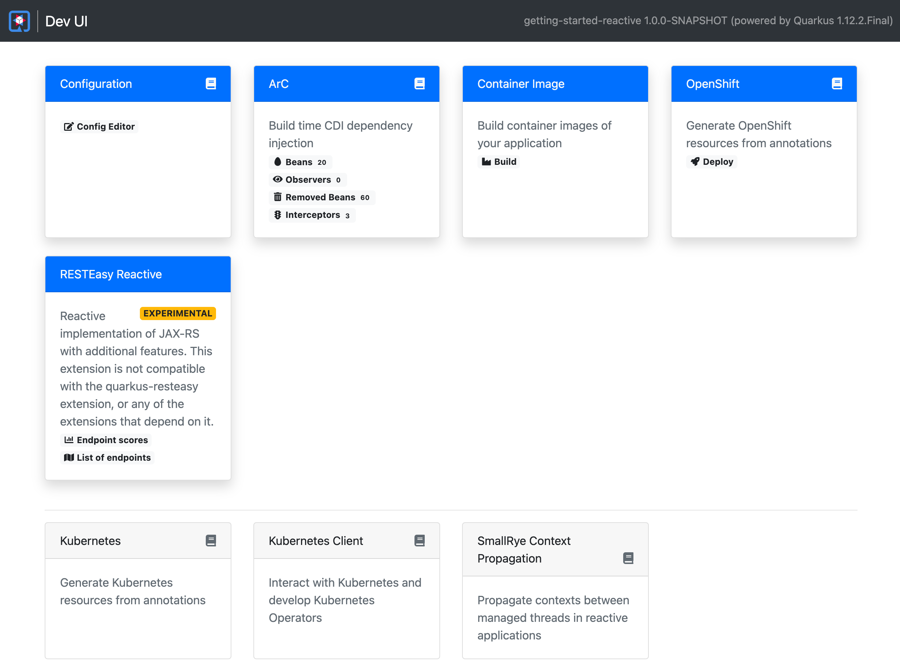
- click build in container image box, select legacy jar for build type, docker for builder type, click build and wait for finish (see terminal log for progress)
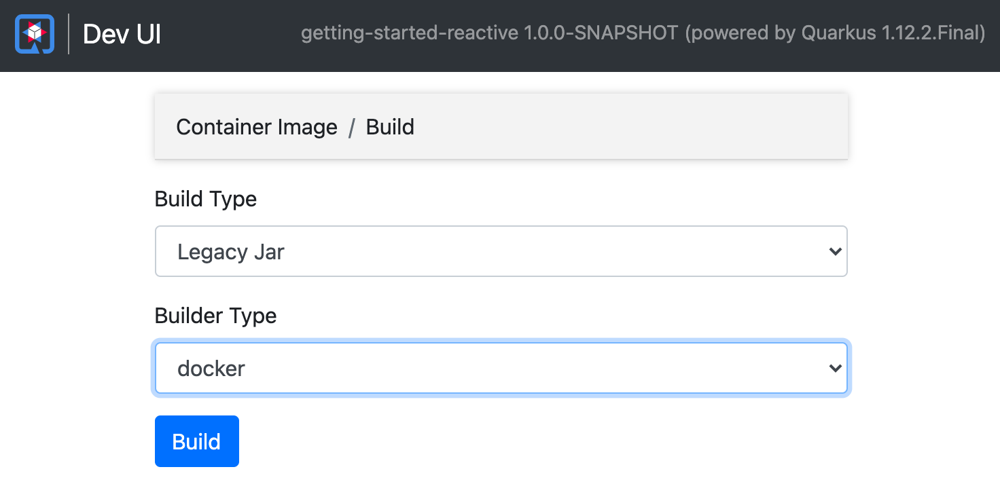
- check new image witn docker command
```bash
$ docker images
REPOSITORY                                                                          TAG                  IMAGE ID       CREATED         SIZE
ckongman/getting-started-reactive                                                   1.0.0-SNAPSHOT       ba4e1d0c2644   9 seconds ago   481MB
redis                                                                               latest               a617c1c92774   5 weeks ago     105MB
```

## Migrate Old Applications New Again with RH AMT
- Download Web Console version from https://developers.redhat.com/products/mta/download
- extract to local workspace
```bash
 ~/work/mta-web-distribution-5.1.0.Final  ll
total 1096
-rw-rw-r--@  1 ckongman  staff   790B Dec  1 10:06 Dockerfile
-rw-rw-r--@  1 ckongman  staff    11K Dec  1 10:06 ECLIPSE_LICENSE.txt
-rw-r--r--@  1 ckongman  staff   419B Feb 18  2020 JBossEULA.txt
-rw-r--r--@  1 ckongman  staff    11K Dec  2  2019 LICENSE.txt
-rw-r--r--@  1 ckongman  staff    39B Dec  2  2019 README.txt
drwxrwxr-x@  3 ckongman  staff    96B Dec  1 10:19 appclient
drwxrwxr-x@ 76 ckongman  staff   2.4K Dec  1 10:19 bin
drwxrwxr-x@  6 ckongman  staff   192B Dec  1 10:19 docs
drwxrwxr-x@  4 ckongman  staff   128B Dec  1 10:19 domain
-rw-r--r--@  1 ckongman  staff   478K Feb 18  2020 jboss-modules.jar
drwxrwxr-x@  4 ckongman  staff   128B Dec  1 10:19 migration
drwxrwxr-x@  5 ckongman  staff   160B Dec  1 10:20 modules
-rw-rw-r--@  1 ckongman  staff    12B Dec  1 10:06 mta-version.txt
drwxrwxr-x@  7 ckongman  staff   224B Dec  1 10:19 openshift
-rw-rw-r--@  1 ckongman  staff   484B Dec  1 10:06 run_mta.bat
-rwxrwxr-x@  1 ckongman  staff   1.4K Dec  1 10:06 run_mta.sh
drwxrwxr-x@  4 ckongman  staff   128B Mar 24 10:06 samples
drwxrwxr-x@  8 ckongman  staff   256B Dec  1 10:19 standalone
...
```
- start with ./run_mta.sh, access web ui at http://localhost:8080/mta-ui
- create project,set project name
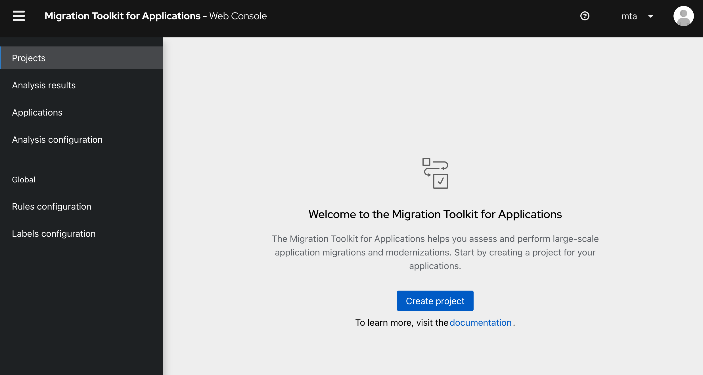
- upload source code, ear, war file (used jee-example-app-1.0.0.ear from samples folder)
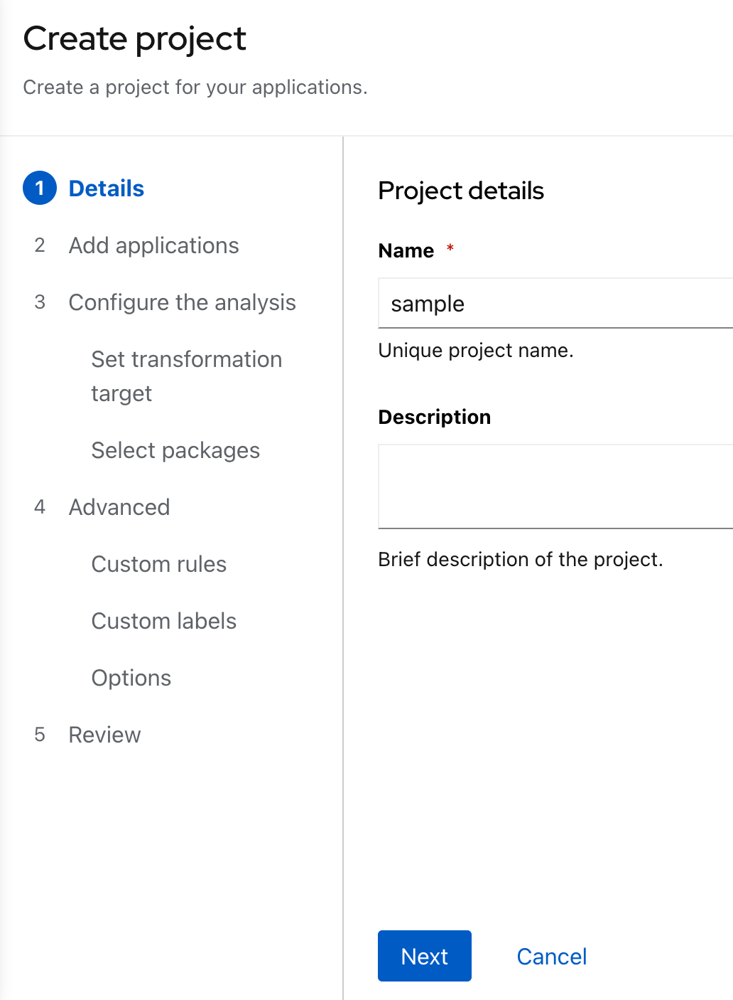
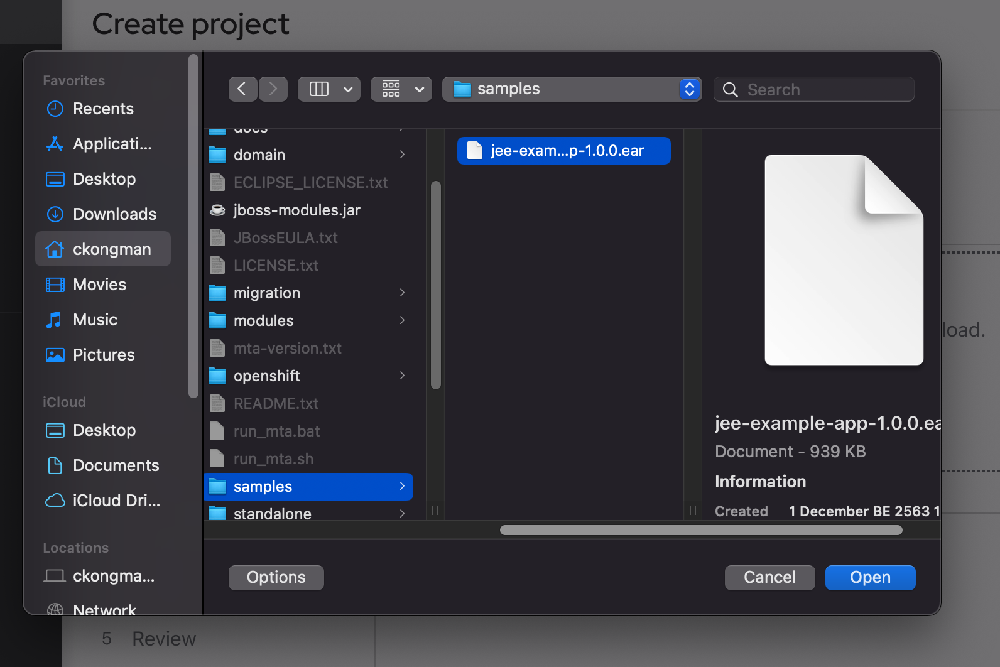
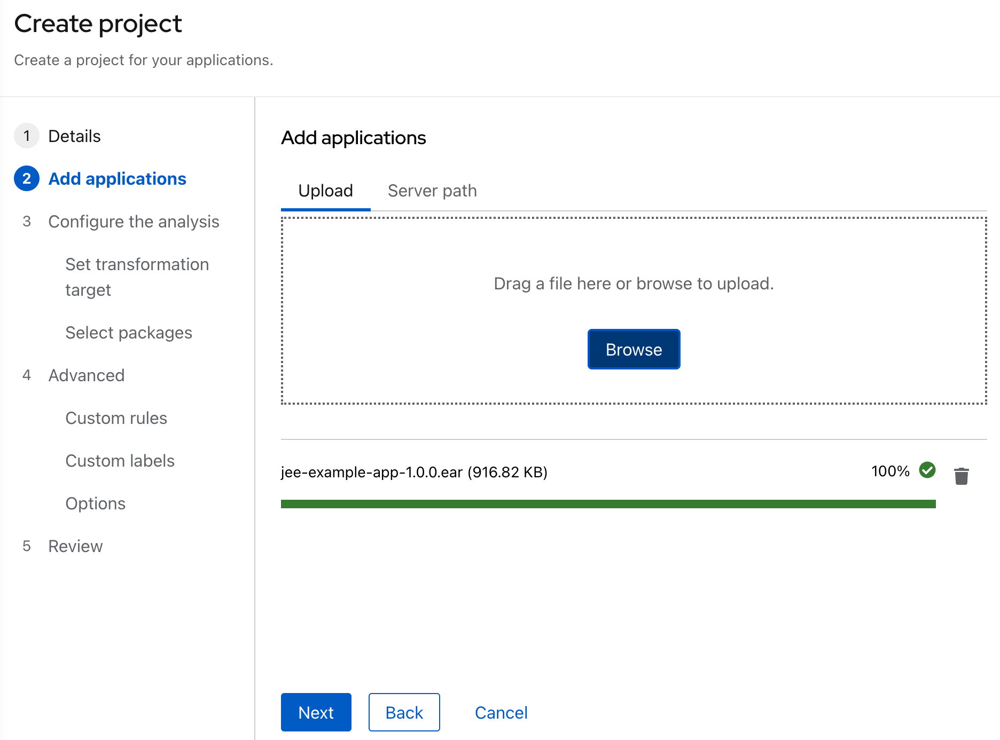
- select target to EAP7

- select package for scan (leave default)
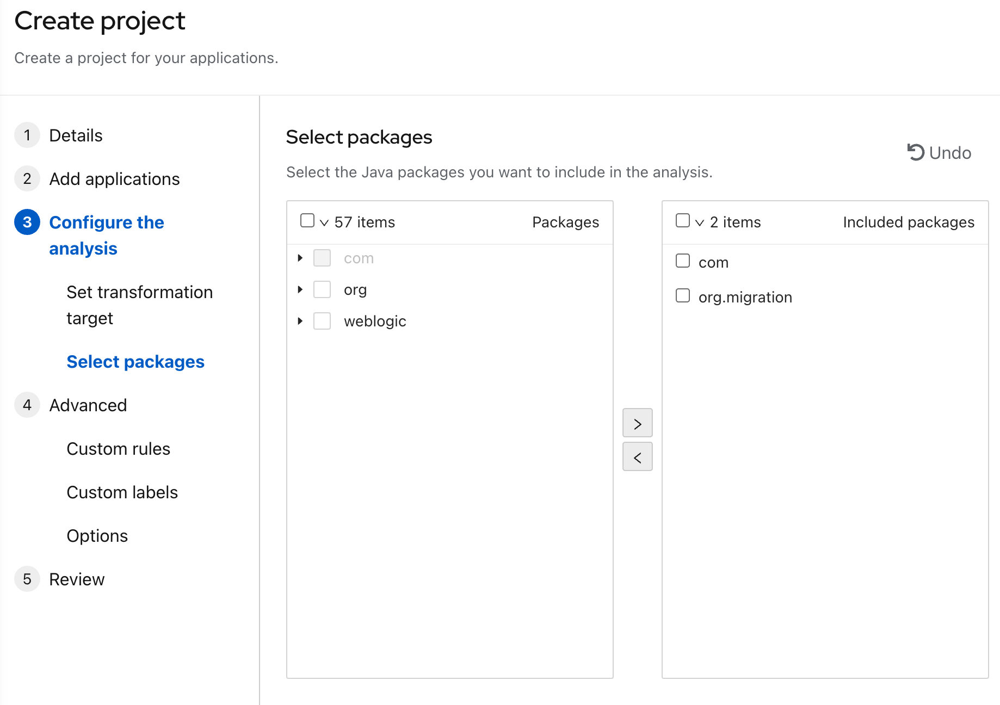
- next to review page and click save and run
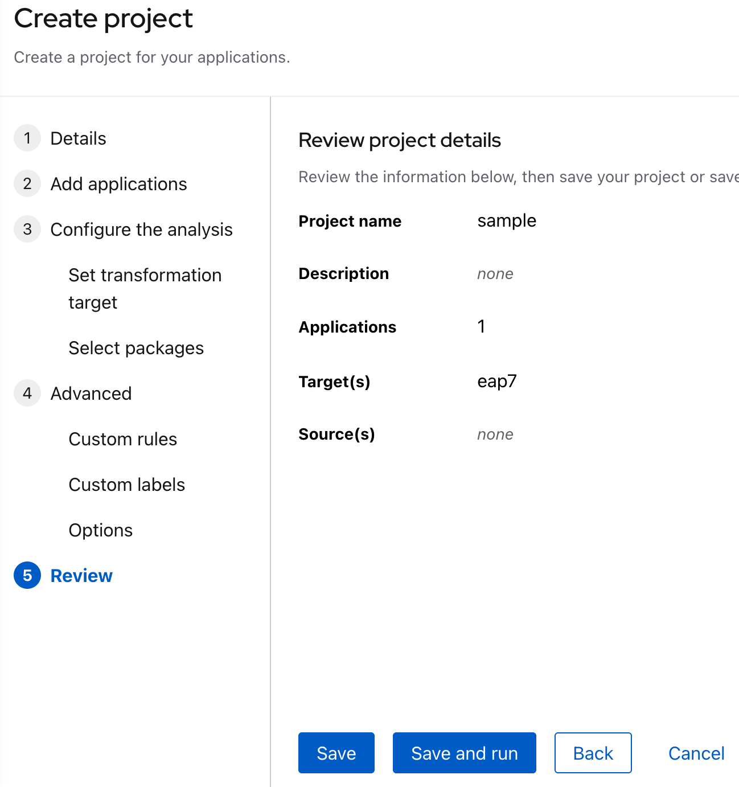
- wait until complete
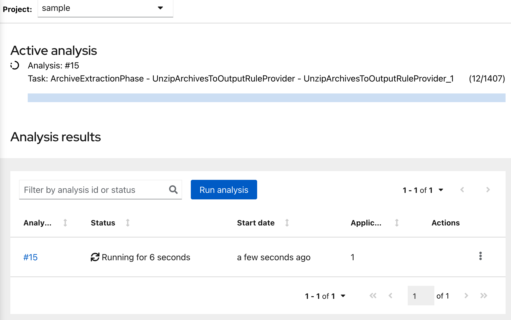
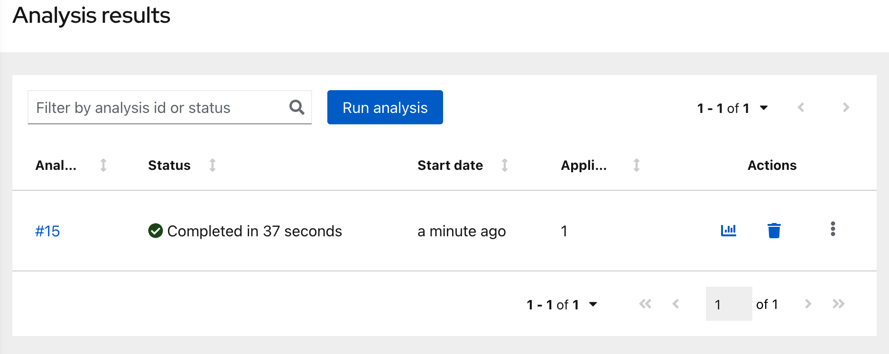
- after finish, click report icon to view result
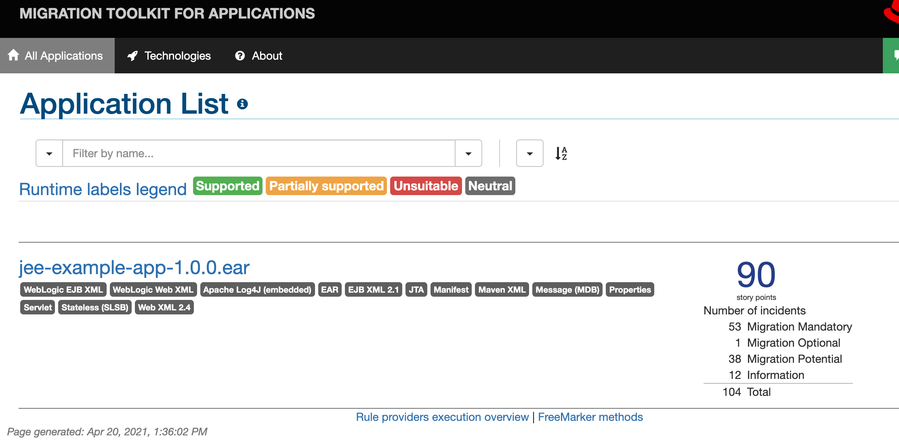
- click jee-example-app-1.0.0.ear for view Dashboard, Issue and How to Migration Code Helper
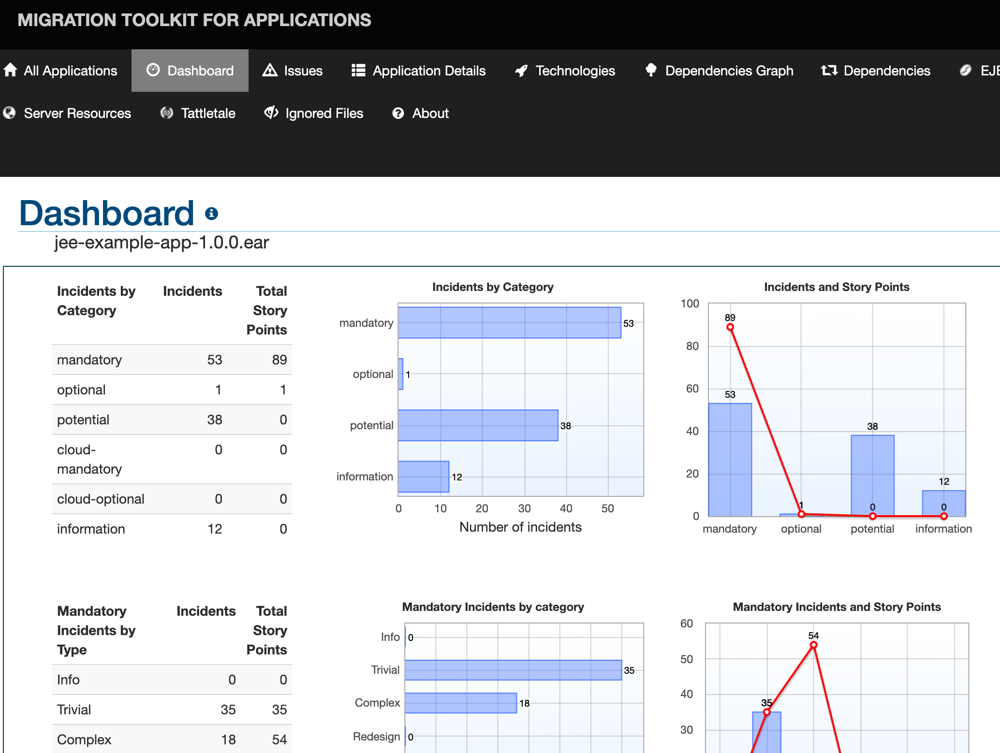
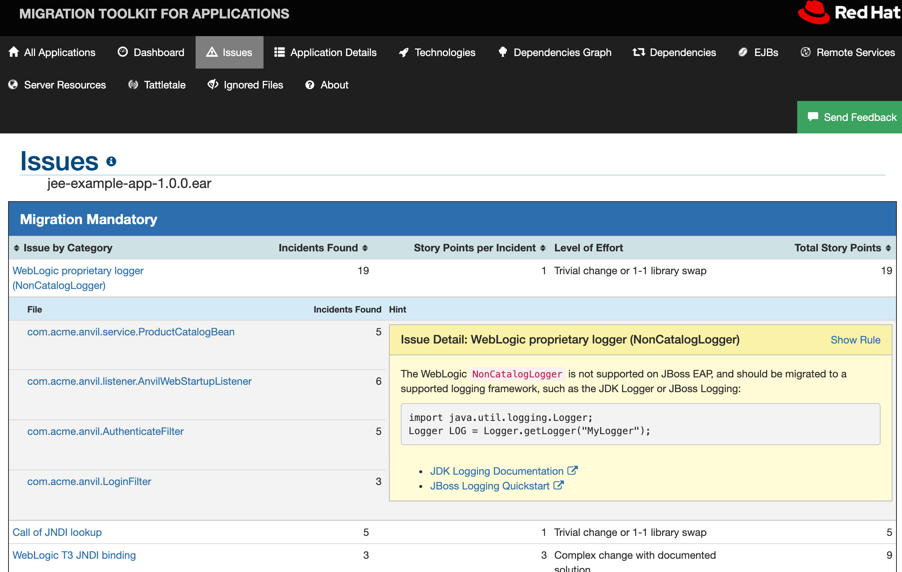