# Introduction to Container Orchestration Platform
<!-- TOC -->

- [Introduction to Container Orchestration Platform](#introduction-to-container-orchestration-platform)
  - [Presentation](#presentation)
  - [From Development to Build and Run on Platform (demo with quarkus)](#from-development-to-build-and-run-on-platform-demo-with-quarkus)
  - [Deploy From Git (Developer Console)](#deploy-from-git-developer-console)
  - [Deploy From Container Repository (Developer Console)](#deploy-from-container-repository-developer-console)
  - [Simple OpenShift Feature](#simple-openshift-feature)

<!-- /TOC -->

## Presentation

Presentation ([openshift.pptx](presentation/openshift.pptx))

## From Development to Build and Run on Platform (demo with quarkus)

- Follow the document from https://quarkus.io/guides/deploying-to-openshift

## Deploy From Git (Developer Console)
- login to OpenShift Console with authorized user
- create project name 'demo'
- switch to Developer Perspective, Topology, click From Git
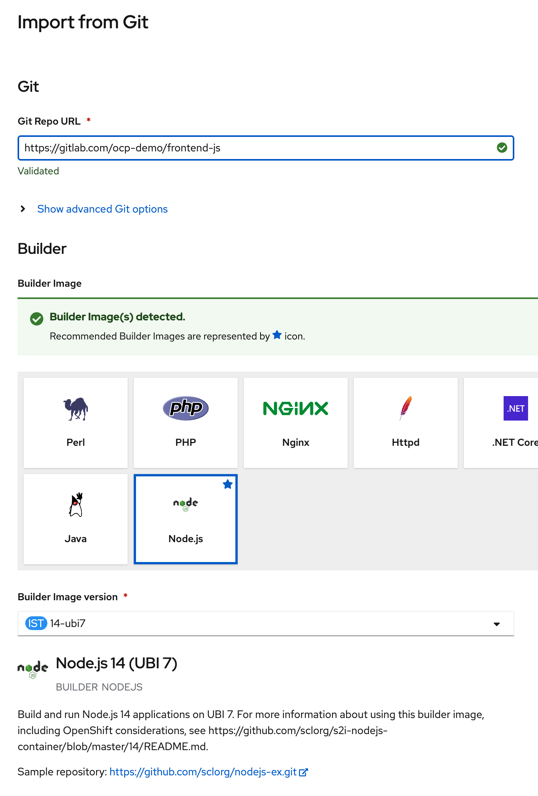
- input git repo URL to https://gitlab.com/ocp-demo/frontend-js
- leave all default, click create
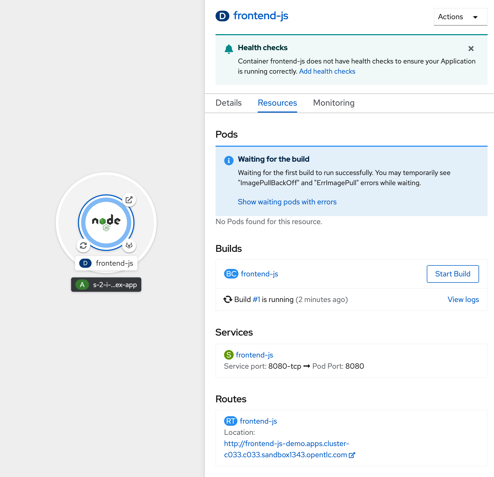
- wait openshift build your source code to container image
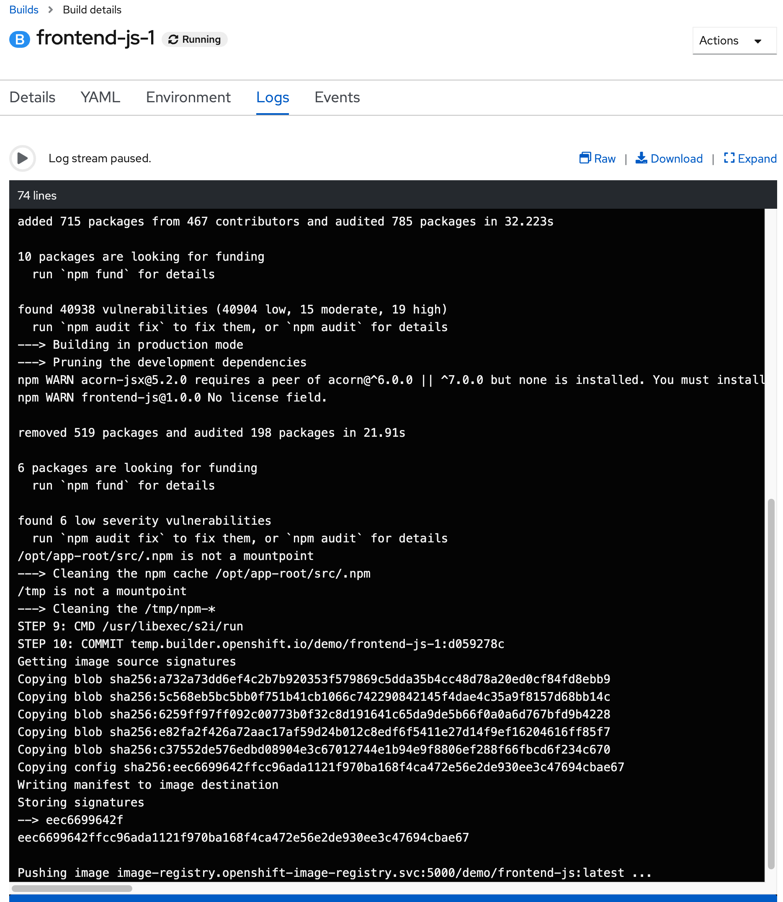
- after build finish, see pod create and running
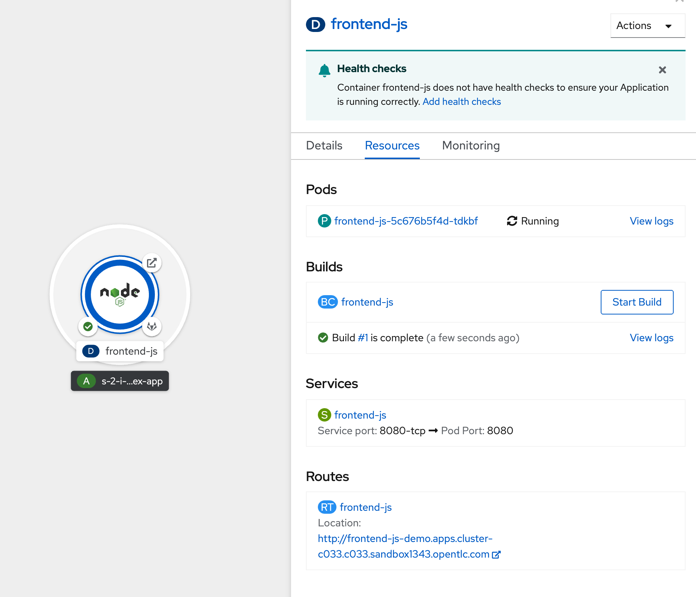
- test with browser call to http://frontend-js-demo.apps.cluster-c033.c033.sandbox1343.opentlc.com/ (change to your cluster or get from route)
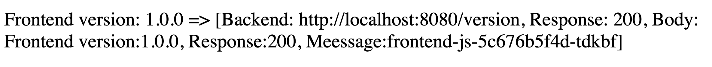

## Deploy From Container Repository (Developer Console)
- in developer perspective, click add
- select add from container image
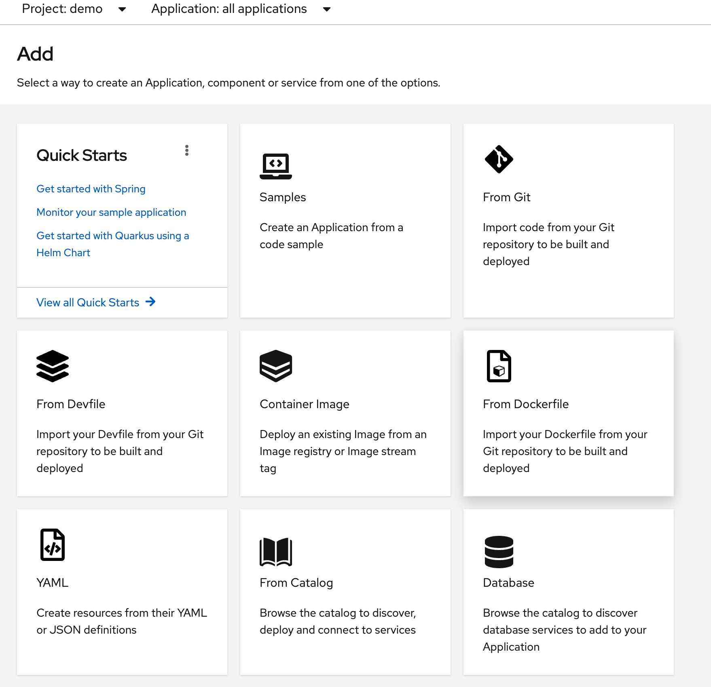
- use image from quay.io/voravitl/frontend-js:v1
- change runtime icon to nodejs
- select Application to Create Application
- change application name to front-app and name to front, leave anoter default
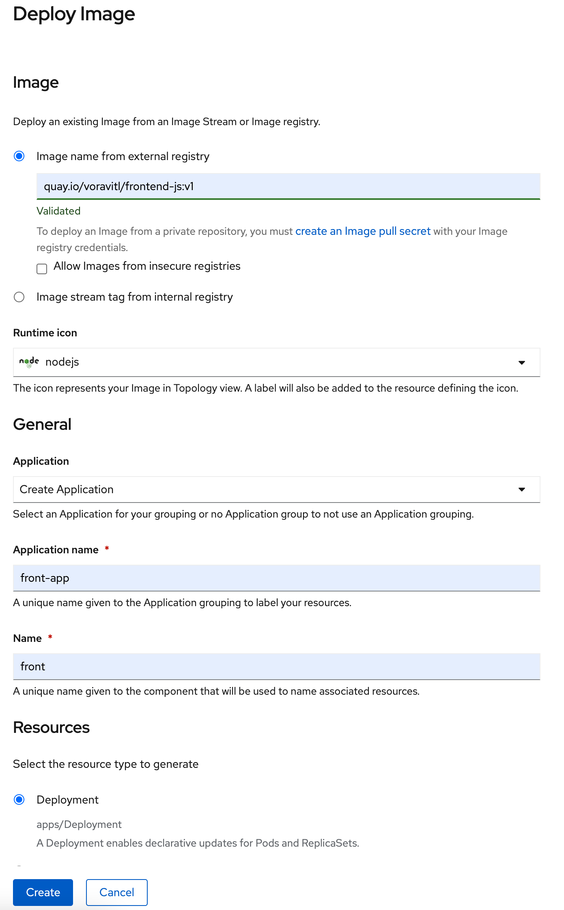
- wait until pod create and running
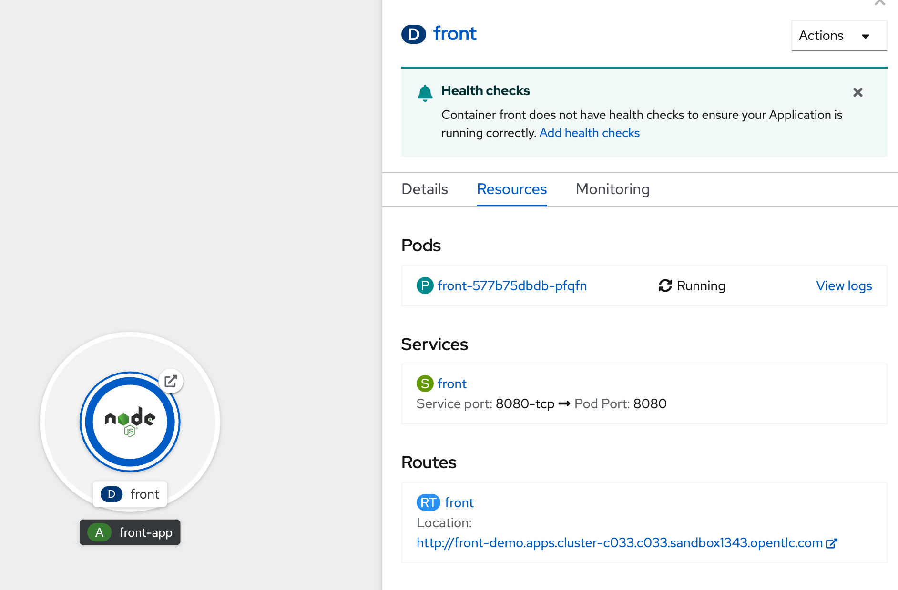

## Simple OpenShift Feature
- Manual Scale Pod
  - select front deployment in demo project
  - go to details tab, click up icon to scaling pod from 1 to 2
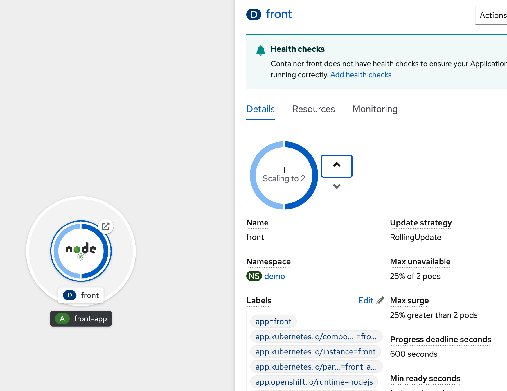
  - review pods in resources tab
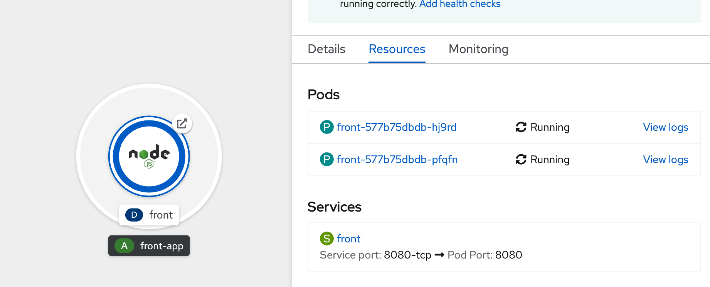
- Monitor Application
  - in front deployment, click monitoring tab, see metrics about CPU usage, and Memory usage

- Access Terminal from Developer Console
  - in front deployment, click first pod in resource tab, and select terminal tab, openshift will connect to container and display web terminal to use access.
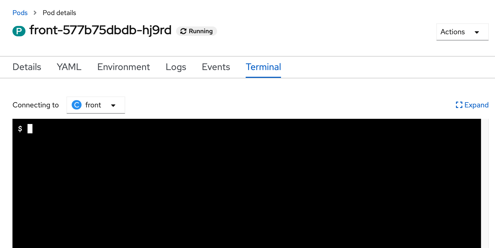
- Operator Hub & Catalog
  - If additional software or components are required to be installed, they can be installed either through the Helm Chart or through the Operator Hub.
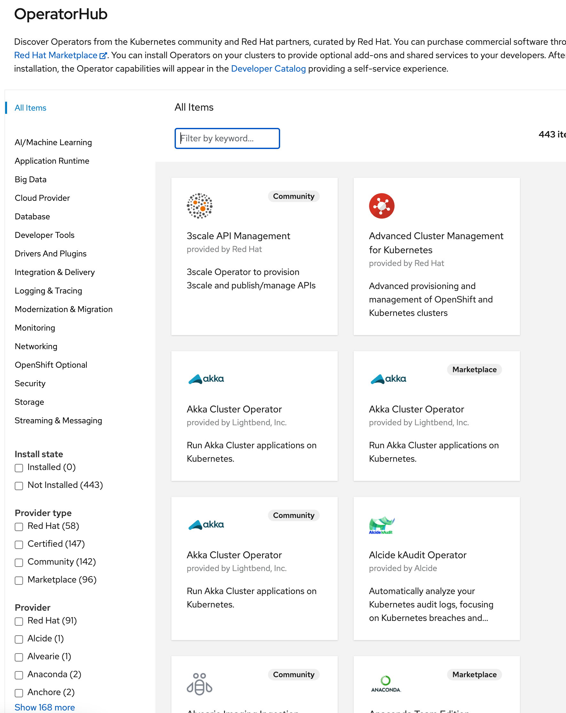  
  - For Dev Teams, developer can create database, middleware, CI/CD Tool with Developer Catalog in Developer Perspective.
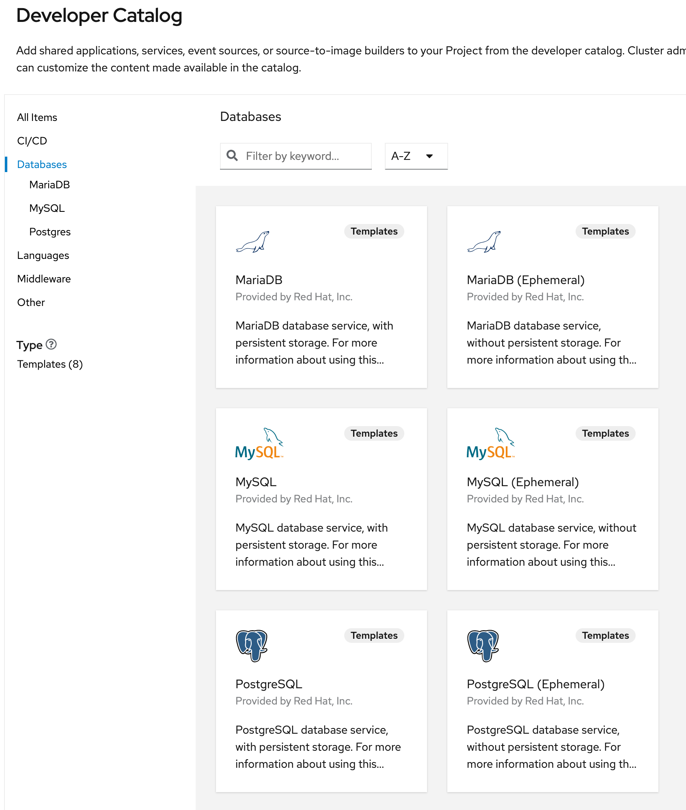

