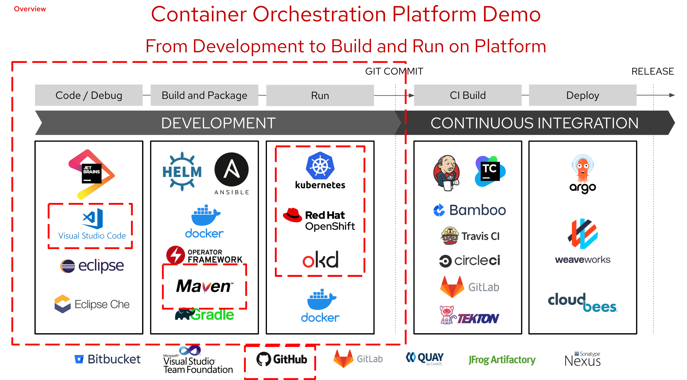

# Introduction to Container Technology
<!-- TOC -->

- [Introduction to Container Technology](#introduction-to-container-technology)
  - [Presentation](#presentation)
  - [From Development to Build and Run on Platform (demo with quarkus)](#from-development-to-build-and-run-on-platform-demo-with-quarkus)
  - [Deploy From Git (Developer Console)](#deploy-from-git-developer-console)
  - [Deploy From Container Repository (Developer Console)](#deploy-from-container-repository-developer-console)
  - [Simple OpenShift Feature](#simple-openshift-feature)

<!-- /TOC -->

## Presentation

Presentation ([openshift.pptx](presentation/openshift.pptx))

## From Development to Build and Run on Platform (demo with quarkus)

- Follow the document from https://quarkus.io/guides/deploying-to-openshift

## Deploy From Git (Developer Console)
- login to OpenShift Console with authorized user
- create project name 'demo'
- click 

## Deploy From Container Repository (Developer Console)

## Simple OpenShift Feature
- Manual Scale Pod
- Monitor Application
- Access Terminal from Developer Console
- Operator Hub & Catalog
  

